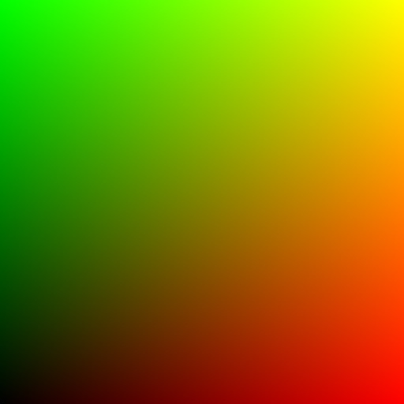

# Installation

### Prerequisites

- [Node.js](https://nodejs.org/en/download) version `20.15` or higher.
- NPM version `10.9` or higher.

<br />

When creating a new project, the recommended way to get started is by scaffolding it with [Vite](https://vite.dev/).
Once it is created, or if you already have an existing one, UWAL can be installed with any of the following commands from your terminal:

::: code-group

```sh [npm]
> npm add uwal
```

```sh [yarn]
> yarn add uwal
```

```sh [pnpm]
> pnpm add uwal
```

```sh [bun]
> bun add uwal
```

```sh [deno]
> deno add uwal
```

:::

## Quick Start

To check the installation was successful, let's walkthrough a basic WebGPU program. Copy and paste the following code in the main JavaScript/TypeScript file to create a full-screen gradient like the one on the image below. The example includes some explanatory comments on what is happening on every line.

### Preview

```js
// Import some utility shaders and WebGPU renderer from UWAL and rename
// the latter one to `RenderStage` to use `Renderer` variable locally.
import { Shaders, Renderer as RenderStage } from "uwal";

// Create a simple WGSL shader to output canvas coordinates as a
// linear gradient from the bottom-left to the top-right corner.
const Gradient = /* wgsl */`
struct VertexOutput
{
    @location(0) texCoord: vec2f,      // Gradient coordinates
    @builtin(position) position: vec4f // Vertex position
};

// Vertex shader code; the function name "vertex"
// is the default one when creating a render pipeline.
@vertex fn vertex(@builtin(vertex_index) index: u32) -> VertexOutput
{
    // This function is part of the included "Fullscreen" shader.
    // It converts a vertex index to a coordinate of a very
    // large triangle that's covering the whole canvas.
    let coord = GetFullTriCoord(index);

    return VertexOutput(
        // Another function from the "Fullscreen" shader.
        // It converts vertex coordinates so the origin shifts
        // from the center to the bottom-left corner of the canvas.
        GetFullTexCoord(coord), // Normalized vertex coordinates
        vec4f(coord, 0, 1)      // Clip space coordinates
    );
}

// Fragment shader code; the function name "fragment"
// is the default one when creating a render pipeline.
@fragment fn fragment(@location(0) texCoord: vec2f) -> @location(0) vec4f
{
    // Output current pixel color.
    return vec4f(texCoord, 0, 1);
}`;

// Create a `canvas` element and add it to the <body>.
const canvas = document.createElement("canvas");
document.documentElement.appendChild(canvas);

// Create a new WebGPU renderer using the canvas above.
const Renderer = new (await RenderStage(canvas));

// Create a new render pipeline using two shaders and
// automatically add it to the renderer for it to use.
const RenderPipeline = await Renderer.CreatePipeline([
    Shaders.Fullscreen, Gradient
]);

// Set the `canvas` element to the full size of the page.
Renderer.SetCanvasSize(innerWidth, innerHeight);
// Set the amount of vertices to draw.
RenderPipeline.SetDrawParams(3);
// Issue a draw call.
Renderer.Render();
```



For a more complete example showing also how to use uniforms in a similar program, feel free to check the [Screen Shader](https://ustymukhman.github.io/uwal/dist/examples/examples.html#screen-shader) example and its [source code](https://github.com/UstymUkhman/uwal/tree/main/src/examples/screen-shader).

::: tip TIP:

When working on more complex applications, adding [vite-plugin-glsl](https://www.npmjs.com/package/vite-plugin-glsl) as a dev dependency to your project might be a good idea since it allows you to import common chunks into your main shader files and discard the `?raw` suffix when importing shaders from external source files.

:::
