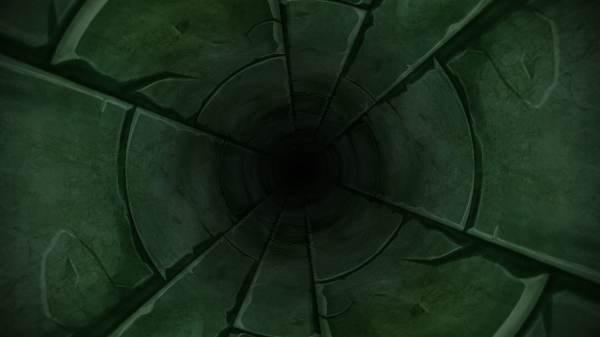
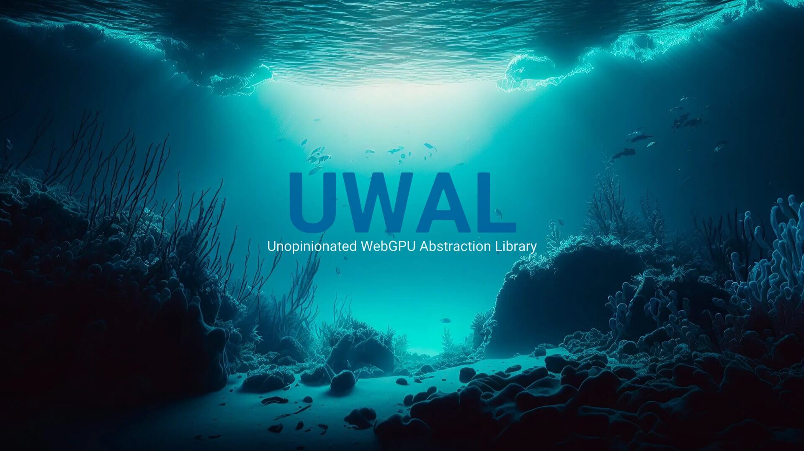

<p align="center">
  <a title="UWAL" href="https://ustymukhman.github.io/uwal/" target="_blank" rel="noopener noreferrer">
    
  </a>
</p>

<h1 align="center">UWAL</h1>

<p align="center">
  
  
  
  
</p>

<p align="center">
  <i>The goal of UWAL is to remove as much boilerplate as possible when working with the WebGPU APIs, while still providing a flexible interface with reasonable defaults for all configuration options.</i>
</p>

## Introduction

- UWAL is very minimal, under development and in early alpha stage, so expect breaking changes in the future.
- There are no plans to implement any WebGL fallback, so keep an eye on [browsers that support](https://caniuse.com/webgpu) WebGPU APIs.
- It is aimed at developers who like minimal layers of abstraction and are interested in writing their own shaders.

## [Installation](https://www.npmjs.com/package/uwal)

```bash
npm i uwal
# or
yarn add uwal
# or
pnpm add uwal
# or
bun add uwal
```

## [Examples](https://ustymukhman.github.io/uwal/dist/examples/examples.html)

| Basic Program | Ripple Effect |
|:-:|:-:|
| [](https://www.youtube.com/watch?v=TOCvJR07H6k) | [](https://www.youtube.com/watch?v=j07n96qDe20) |

### [WebGPU Fundamentals](https://webgpufundamentals.org/)

- Basics
  - [Fundamentals](https://ustymukhman.github.io/uwal/dist/lessons/lessons.html#fundamentals)
  - [Inter-stage Variables](https://ustymukhman.github.io/uwal/dist/lessons/lessons.html#inter-stage-variables)
  - [Uniforms](https://ustymukhman.github.io/uwal/dist/lessons/lessons.html#uniforms)
  - [Storage Buffers](https://ustymukhman.github.io/uwal/dist/lessons/lessons.html#storage-buffers)
  - [Vertex Buffers](https://ustymukhman.github.io/uwal/dist/lessons/lessons.html#vertex-buffers)
  - Textures
    - [Textures](https://ustymukhman.github.io/uwal/dist/lessons/lessons.html#textures)
    - [Mipmap Filter](https://ustymukhman.github.io/uwal/dist/lessons/lessons.html#mipmap-filter)
    - [Loading Images](https://ustymukhman.github.io/uwal/dist/lessons/lessons.html#loading-images)
    - [Generating mipmaps on the GPU](https://ustymukhman.github.io/uwal/dist/lessons/lessons.html#gpu-mipmaps)
    - [Loading Canvas](https://ustymukhman.github.io/uwal/dist/lessons/lessons.html#loading-canvas)
    - [Loading Video](https://ustymukhman.github.io/uwal/dist/lessons/lessons.html#loading-video)
    - Texture Atlases _(TBI after WebGPU Cameras)_
    - [Using Video](https://ustymukhman.github.io/uwal/dist/lessons/lessons.html#using-video)
    - [Cubemaps](https://ustymukhman.github.io/uwal/dist/lessons/lessons.html#cubemaps)
    - [Storage Textures](https://ustymukhman.github.io/uwal/dist/lessons/lessons.html#storage-textures)
    - [Multisampling](https://ustymukhman.github.io/uwal/dist/lessons/lessons.html#multisampling)
  - [Shader Constants](https://ustymukhman.github.io/uwal/dist/lessons/lessons.html#shader-constants)
  - [Transparency and Blending](https://ustymukhman.github.io/uwal/dist/lessons/lessons.html#transparency)
  - [Blend Settings](https://ustymukhman.github.io/uwal/dist/lessons/lessons.html#blend-settings)
  - [Bind Group Layouts](https://ustymukhman.github.io/uwal/dist/lessons/lessons.html#bind-group-layouts)
  - [Timing Performance](https://ustymukhman.github.io/uwal/dist/lessons/lessons.html#timing-performance)
  - Compatibility Mode _(TBI)_
- 3D Math
  - [Translation](https://ustymukhman.github.io/uwal/dist/lessons/lessons.html#translation)
  - Rotation _(WIP)_
